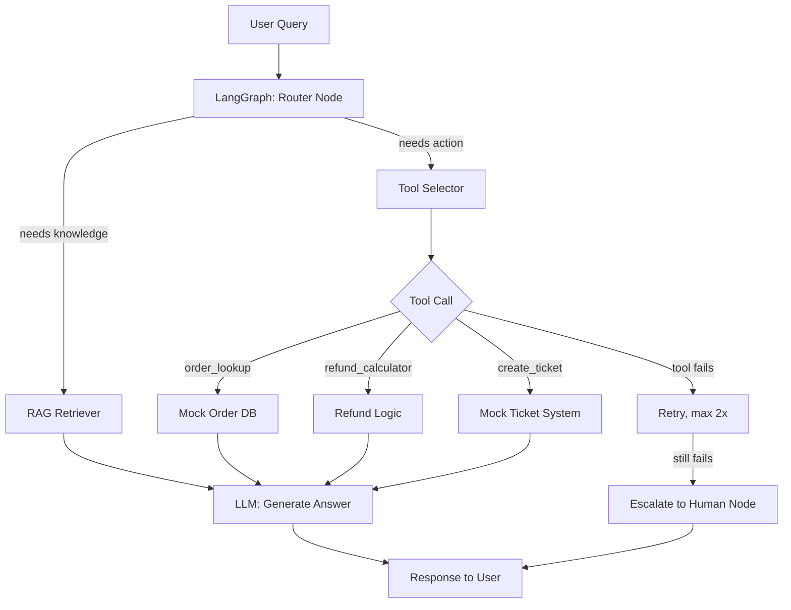

# Agentic Support Assistant

An LLM-powered agent that answers product support questions using RAG, calls real
tools (order lookup, refund calculation, ticket creation), and handles failures
gracefully via a LangGraph state machine — built to demonstrate the core skills
of an AI/Agent Engineer role: **RAG, LangChain, LangGraph, tool calling, agentic
error handling, and evaluation.**

## Why this project

Most fresher portfolios have a basic chatbot. This project instead demonstrates:

| Skill (from JD)                        | Where it lives in this repo              |
|-----------------------------------------|-------------------------------------------|
| RAG                                     | `src/rag.py`                              |
| LangChain                               | `src/rag.py`, prompt templates            |
| LangGraph / agent behaviors             | `src/agent.py`                            |
| Tool Calling / Function Calling         | `src/tools.py`                            |
| Edge cases, failures, recovery flows    | retry + escalation logic in `agent.py`    |
| Evaluation / regression tests           | `src/eval.py`, `tests/`                   |
| Rapid AI POC                            | this whole repo — built in a few days     |

## Architecture



The agent is a **graph, not a chain** — it can loop back to retry a failed tool
call, branch to escalation, or go straight to RAG, which is what "agentic"
actually means in practice (as opposed to a single linear prompt → response).

## Setup

```bash
pip install -r requirements.txt
export ANTHROPIC_API_KEY="your-key-here"
python main.py
```

## Project structure

```
ai-support-agent/
├── data/docs/          # sample knowledge base (product docs, RAG source)
├── src/
│   ├── rag.py          # chunking, embedding, retrieval
│   ├── tools.py        # mocked tools the agent can call
│   ├── agent.py         # LangGraph state machine: the core agent
│   └── eval.py          # evaluation harness + test cases
├── tests/
│   └── test_eval.py     # run this to see pass/fail scores
├── main.py               # CLI chat loop
└── requirements.txt
```

## Running the evaluation suite

```bash
python -m tests.test_eval
```

This runs a set of test queries against the agent and scores whether it:
- retrieved the right knowledge base doc
- called the correct tool
- handled a deliberately-broken tool call correctly (recovery flow)

This is the piece most fresher projects skip, and it's explicitly in the JD
("Build evaluation and regression test scenarios") — so make sure to walk an
interviewer through this file specifically.

## Extending this for your portfolio (optional but strong signal)

- **Voice AI**: pipe `main.py` input/output through `faster-whisper` (STT) and
  a TTS API — the JD lists Voice AI as a skill, this is an easy add-on.
- **Deploy it**: wrap `agent.py` in a FastAPI endpoint and deploy on Render/
  Railway free tier so you have a live demo link, not just a GitHub repo.
- **Swap the mock DB for a real API** (e.g. a free public API) to show you can
  integrate with real external systems, not just hardcoded data.
- **Record a 2-minute Loom video** walking through the graph and the eval
  results — recruiters and interviewers are far more likely to watch a video
  than clone and run a repo.

## Talking points for interviews

- Why LangGraph over a plain LangChain chain (state, branching, retries)
- How the escalation node prevents the agent from hallucinating an answer when
  it genuinely doesn't know
- How you'd extend the eval suite if this were a real production agent
  (e.g. adding an LLM-as-judge for open-ended answers)
